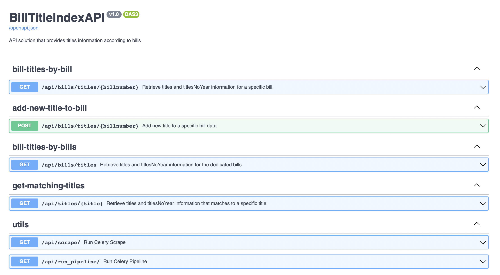
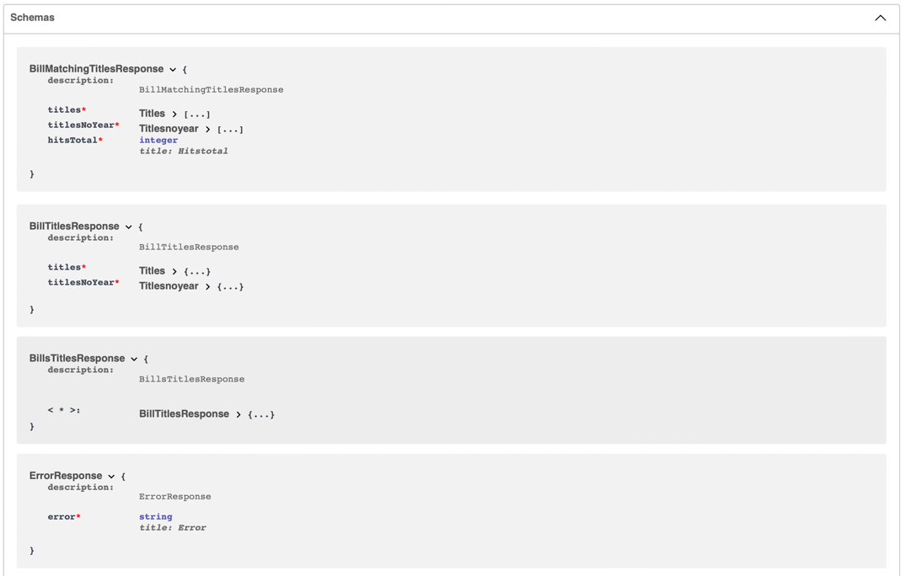
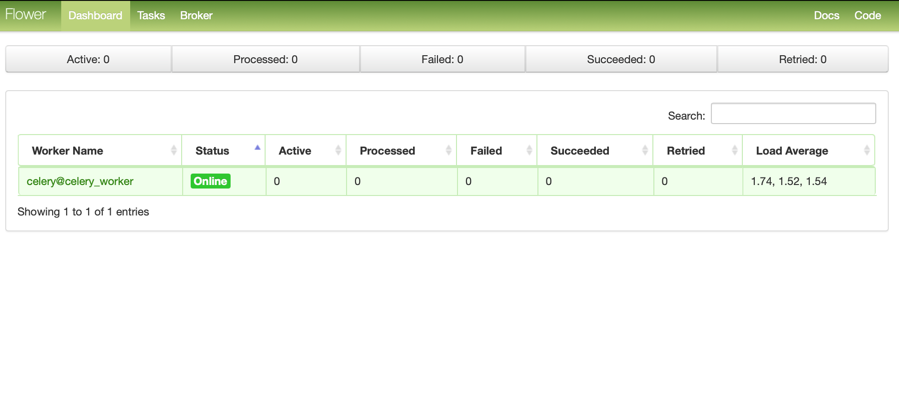
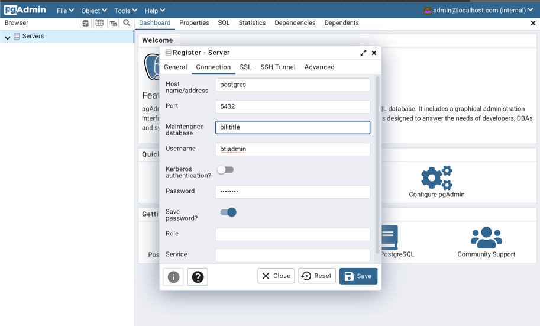
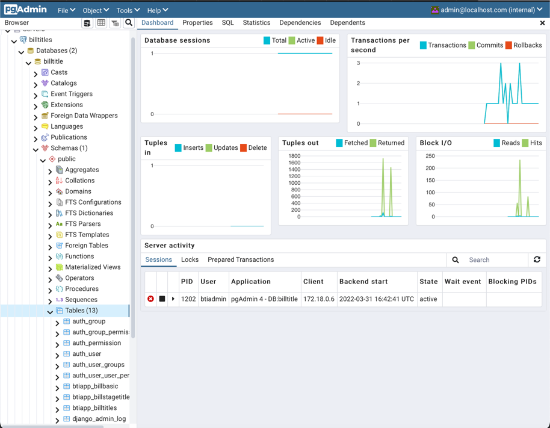
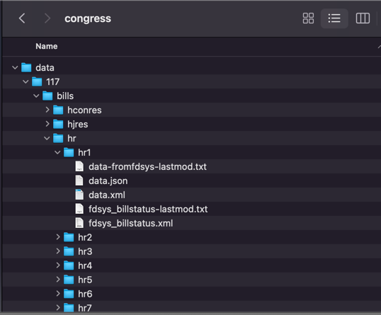

:toc:

# BillTitleIndex 

## Overview

The BillTitleIndex repository gathers metadata about the titles of the bills in the United States Congress. This information is collected, added to a PostgreSQL database, and then used to create a searchable index and API. This API is combined with an
API that identifies similar bills (aih/billtitles-py), and this combined API will be used by the BillMap project (/unitedstates/Bill
Map) which provides context and associated documents for similar bills (e.g. companion bills, related bills, etc.).

This repository provides a containerized environment that scrapes bill metadata from scratch; processes and stores data to PostgreSQL and Elasticsearch; and provides an API with FastAPI/Swagger/OpenAPI to search bill titles.

The docker-compose orchestrates the following containers:
    * PostgreSQL database
    * Elasticsearch index
    * Celery workers
    * RabbitMQ message broker
    * Flower server
    * FastAPI API

## Tools
### https://swagger.io[Swagger]
Swagger is a tool to work with self-documented code.
This is a great out of the box feature of FastAPI.
It allows writing documentation directly in the code and shows it in the UI, testing API endpoints, describing request parameters and schemas for requests and responses.



[#swagger-schemas]


### https://flower.readthedocs.io/en/latest/[Flower]
Tool to control and monitor celery workers.

Accessible by this url http://localhost:5555

``NOTE:`` Default Login / Password: `admin/root`. Can be configured by `.env` file.



### https://www.pgadmin.org[PgAdmin]
Tool to query Postgres Database, monitor DB state, etc.

Accessible by this url http://localhost:5050

``NOTE:`` Default Login / Password: `admin@localhost.com/root`. Can be configured by `.env` file.

.Staring from the scratch you won't have added databases, so you can do it:
* right click on `Servers` (top left corner)
* Register -> Server



Then you will see:




## Usage

### API Usage

Once the API is running, you can access it at port `8000` of the host (defined in the docker-compose).

The API routes and schemas are described with <<swagger-schemas,swagger>>.

## Deployment with docker-compose

.If you already have loaded bills BULK data - put loaded data into the project directory in the same folder where `docker-compose.yml` file is found.

How to download data is described <<bulk-data-download, here>>.
After downloading one archive you will have to unpack it and you will see such structure of folders and files: 

Where the top folder is called `data`, which contains folder with digits name - which means congress number. Inside each congress you see folders [`hconres`, `hjres`, `hr` and others].

If you want to provide more data (not for only one congress) you have to merge all downloaded data folders (`r'data/\d*'` - all root folders of each data unpacked archive) into one folder `data/`, so the folders structure should look like this:
image:docs/img/img_1.png[]

Run this command to process bills information:

```bash
docker compose run api usc-run bills
```

Now you can run loading data into the database (PostgreSQL and replicate data to ElasticSearch) <<pipe-line-configuration, as described here>>.


To start all services run this command:
```bash
docker-compose up -d
```

This will start the docker containers, including both the scrapers for bill metadata and indexing of the titles and the FastAPI server.

`NOTE:` If you don't have loaded congress bills data yet - you will need to trigger tasks through <<swagger-trigger-tasks,Swagger UI>> or running <<run-scrapers-pipeline,this>> command in terminal.

### Docker compose usage
There are 2 `docker-compose` config files:

* `docker-compose.yml` - is the main configuration file for docker-compose command, which should be used for deployment on the prod server
* `docker-compose.override.yml` - the main purpose of this file is to allow modifications inside the main `docker-compose.yml` file without actual changes inside  it. It allows to re-define services and theirs configuration for local development needs.


.Be aware:
* Docker compose automatically apply these files if it sees that `.override` file exists next to the main docker-compose file.

* `docker-compose.override.yml` overrides path to `.env` file with `.env.local`. So for local development you can change any variable in `.env.local` file.

* `docker-compose.override.yml` file should be removed when it's deploying on the prod - so docker compose will use `.env` file which can be created by copying and modifying `.env.local`.

### Development
For local development you should install such tools:

#### pre-commit

Allows to set git pre-commit hooks. Read about this great tool https://pre-commit.com[here]

To install it run one of provided commands:
```bash
pip install pre-commit
# OR
brew install pre-commit
```

Before actual development started run this command in the root directory of the project. It will setup git hooks:
```bash
pre-commit install
```

Now you can test that it works:

```bash
pre-commit run --all-files
```

If you see this error it means that it modified files to follow standards (eg PEP8):
```
autoflake................................................................Failed
- hook id: autoflake
- files were modified by this hook
Reorder python imports...................................................Failed
- hook id: reorder-python-imports
- exit code: 1
- files were modified by this hook
```

And if you run `pre-commit run --all-files` command again you will see that all everything passed:
```
autoflake................................................................Passed
Reorder python imports...................................................Passed
```

`NOTE:` Usually you don't need to run it manually. Git will trigger this tool automatically once you try to commit something.

.Hooks and linters to run by these hooks:
 * https://github.com/PyCQA/flake8[flake8]
 * some hooks from https://github.com/pre-commit/pre-commit-hooks[default set of pre-commit hooks]:
** check-ast - to check that code can be compiled
** debug-statements - disallow debug statements in the code
* https://github.com/IamTheFij/docker-pre-commit[docker-compose-check]
* Dockerfile linter https://github.com/AleksaC/hadolint-py[hadolint]
* code autoformatting tools:
** https://github.com/psf/black[black]
** https://github.com/PyCQA/autoflake[autoflake]
** https://github.com/asottile/reorder_python_imports[reorder-python-imports]

`NOTE:` `pre-commit` tool will install all these tools automatically at first run. You don't need to install any of them.

### Used containers and theirs purposes

|===
|Name |Purpose

|api
|runs FastAPI server

|celery_worker
|runs periodic tasks and background tasks to scrape data and process it

|es01
|ElasticSearch service

|flower
|Celery workers control, monitoring and scaling (with ability to auto-scale) tool

|gp_admin
|Postgres server tool to explore data, run queries and etc.
|===

### Docker environment variables:
To configure the environment of containers there should be `.env` file.

|===
|Name |Explanation |Default value

|SECRET_KEY
|Generate random hash to secure django application
|changethis

|APP_MODULE
|Path to the main executable fastAPI module
|billtitleindex.wsgi:app

|FLOWER_BASIC_AUTH
|Flower basic authentication. Should be provided in format username:password
|admin:root

|DATA_DIR
|Mount directory inside the container where congress data is stored
|

|LOCAL_DATA_DIR
|Where is the bills data stored outside of the docker
|../congress/

|POSTGRES_HOST
|Postgres server host name
|postgres

|POSTGRES_USER
|Postgres user name
|btiadmin

|POSTGRES_PASSWORD
|Postgres user password
|btiadmin

|POSTGRES_DB
|DB name
|billtitle

|POSTGRES_PORT
|Postgres port
|5432

|MESSAGE_BROKER_URI
|URI of broker host. Should be in format: `amqp://{hostname}:{port}/`
|amqp://rabbitmq:5672/

|ELASTICSEARCH_URI
|URI of elasticsearch host. Should be in format: `http://{hostname}:{port}` or `https://{hostname}:{port}`
|http://elasticsearch:9200
|===

### Tasks

The pipeline includes the following tasks:

scraping-task-midnight-daily:: responsible for scraping bills.
 This task runs these commands under the hood (one by one):


```bash
  usc-run govinfo --bulkdata=BILLSTATUS
  usc-run bills

```


pipeline-task-everyday-4am:: runs the pipeline at 4:00 AM.
 Gets data collected by `scrape` task, parses files and inserts records into the PostgreSQL database. Once item inserted into DB it replicates data to ElasticSearch indexes.

After deploying with `docker-compose`, the tasks can be triggered manually through the API. 

Scraping is triggered with a GET request to http://localhost:8000/api/scraping/

The pipeline can be manually triggered with a GET request to http://localhost:8000/api/pipeline/.
[#swagger-trigger-tasks]
Or just by clicking a button in swagger UI:

- run scrape process http://localhost:8000/docs#/utils/run_celery_scrape_api_scrape__get[here]
- run pipeline http://localhost:8000/docs#/utils/run_celery_pipeline_api_run_pipeline__get[here]

`TODO:` describe in more detail what the scraper and pipeline tasks do.


## Development (Individual components) 

### How to update recent BillStatus XML Files:

Bill data is primarily collected by using https://github.com/unitedstates/congress/[unitedstates/congress], which covers 2013 to the present.

This project collects data from https://github.com/usgpo/bill-status[the official congressional XML data on legislation], which covers the 113th Congress (2013) to the present.


#### Preferred way is to use docker containers
Docker image created from this repository already include environment, all needed libraries and has already installed https://github.com/unitedstates/congress/[unitedstates/congress].

The process using this tool has 2 parts. First, the XML data must be fetched from https://www.govinfo.gov/[Govinfo]. The script pulls the bill status XML and on subsequent runs only pulls new and changed files:
[#run-scrapers-pipeline]
```bash
docker compose run api usc-run govinfo --bulkdata=BILLSTATUS
```

Then run the bills task to process any new and changed files:

```bash
docker compose run api usc-run bills
```

It's also possible to run commands chaining them with `&&`:

```bash
docker compose run api usc-run govinfo --bulkdata=BILLSTATUS && usc-run bills
```

.It's recommended to do this two-step process no more than every 6 hours, as the data is not updated more frequently than that (and often really only once daily).

---
[#bulk-data-download]
**NOTE**

To get the bulk data of bill status before 2013, we can use the https://www.propublica.org/datastore/dataset/congressional-data-bulk-legislation-bills[ProPublica bulk downloads page].

Data is provided in both JSON and XML formats.
    
    Bulk data from previous congresses can be downloaded by clicking the links below. Bulk data for congresses before and including the 112th was generated by the Sunlight Foundation. Data for congresses the 113th Congress and subsequent congresses was generated by ProPublica, using code from the [@UnitedStates GitHub organization](https://github.com/unitedstates).

[#pipe-line-configuration]
### Pipeline

#### Preferred way is to use docker container
To run pipeline just execute this command:

- Run all containers:

```bash
docker compose up -d
```

- Run pipeline command:

```bash
docker-compose run api python manage.py runpipeline
```
